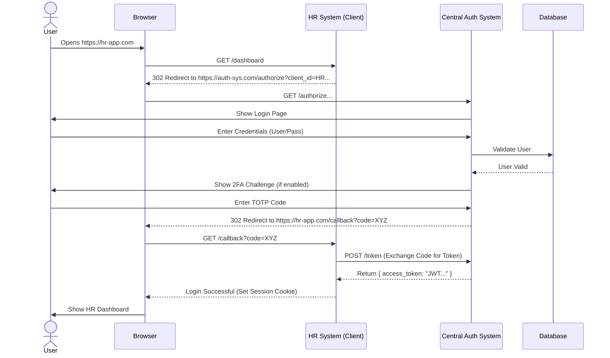
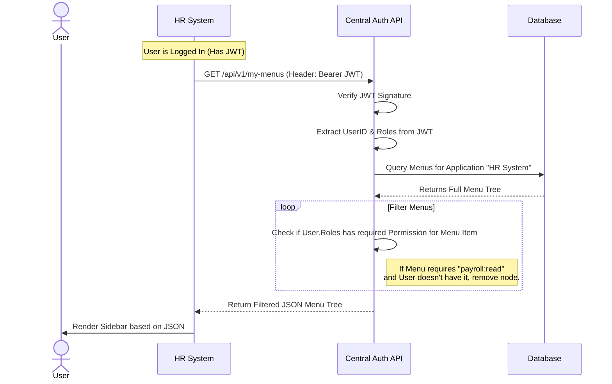
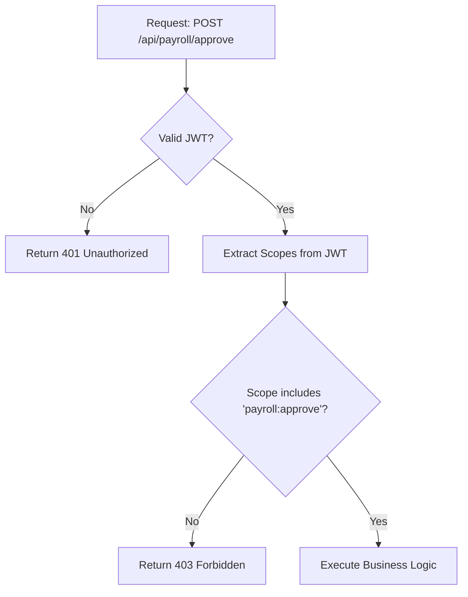

# System Architecture & Flow Diagrams

## 1. Overall System Architecture
High-level view of how the Central Auth System acts as the hub for all Tenants and Applications.

```mermaid
graph TD
    User((User))
    
    subgraph "External Clients (Tenants)"
        HR_App[HR System (.NET)]
        Payroll_App[Payroll System (Python)]
        Mobile_App[Mobile App (Flutter)]
    end

    subgraph "Central Identity Provider"
        Auth_Core[Auth Core API]
        Admin_Panel[Admin Dashboard (React)]
        DB[(Database)]
    end

    User -->|Access| HR_App
    User -->|Access| Payroll_App
    
    HR_App -->|Redirects for Login| Auth_Core
    Payroll_App -->|Redirects for Login| Auth_Core
    
    Auth_Core -->|Reads/Writes| DB
    Admin_Panel -->|Manages| Auth_Core
```

---

## 2. User -> HR System (SSO Login Flow)
Sequence of events when a user tries to access the HR System.



---

## 3. Authorization & Menu Generation Process
How the system decides what the user sees after they are logged in.



---

## 4. Internal Data Flow (Permission Check)
Logic inside the API when a user tries to perform an action.


